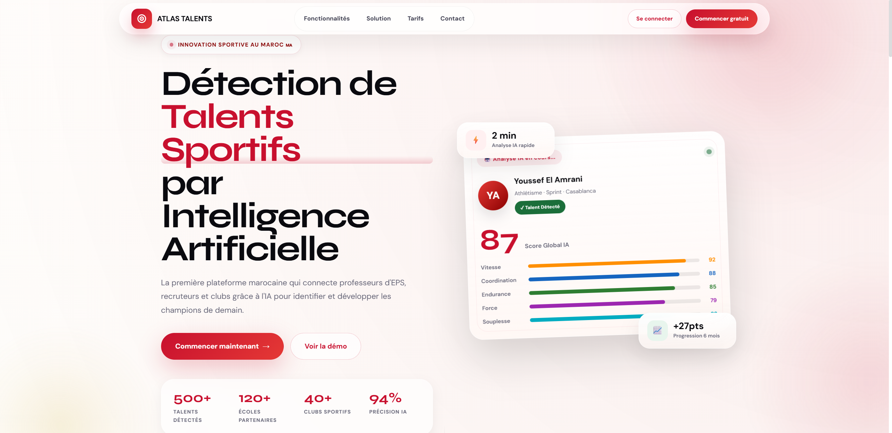
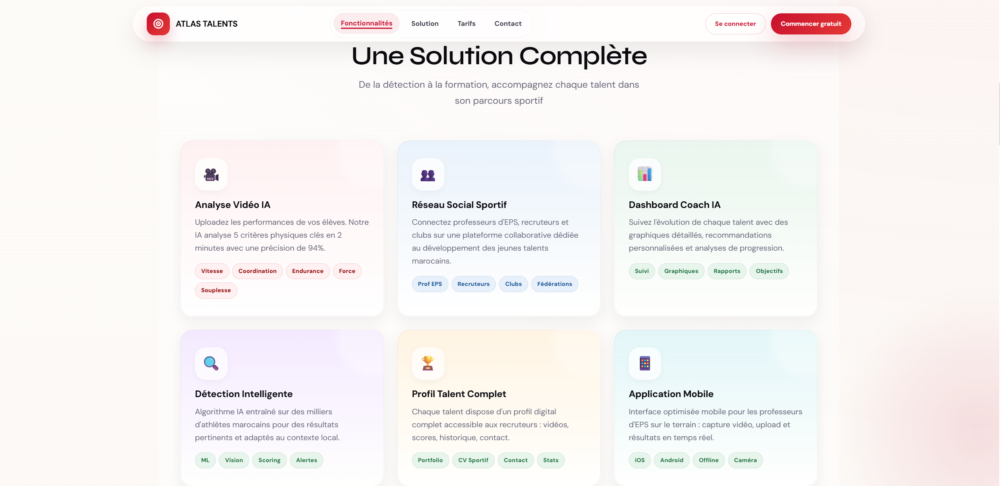
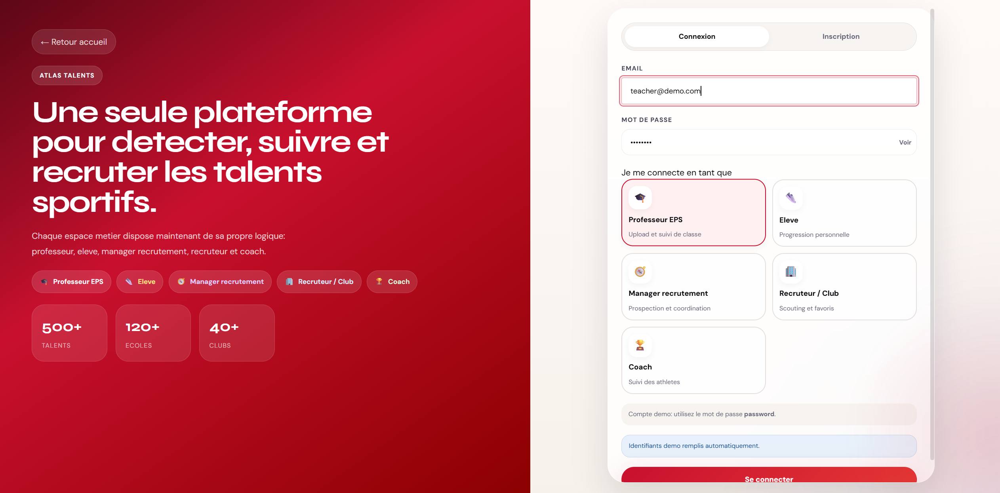
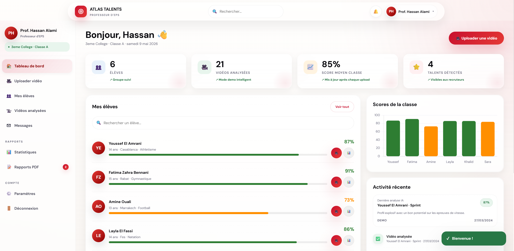
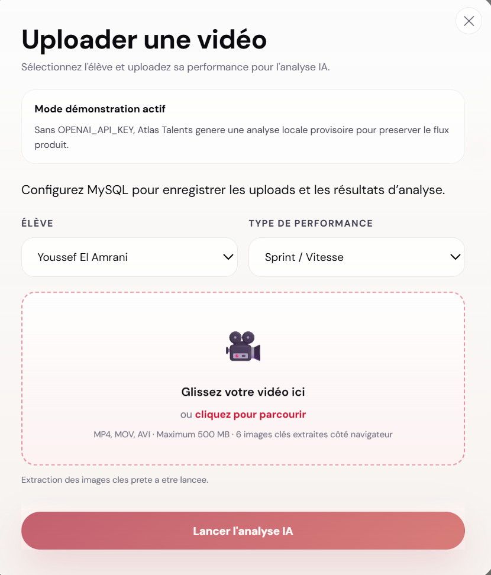
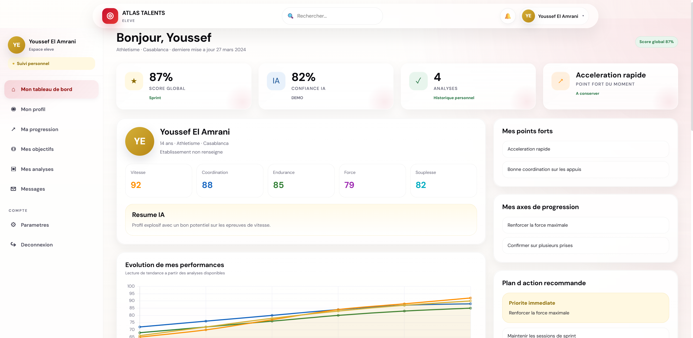
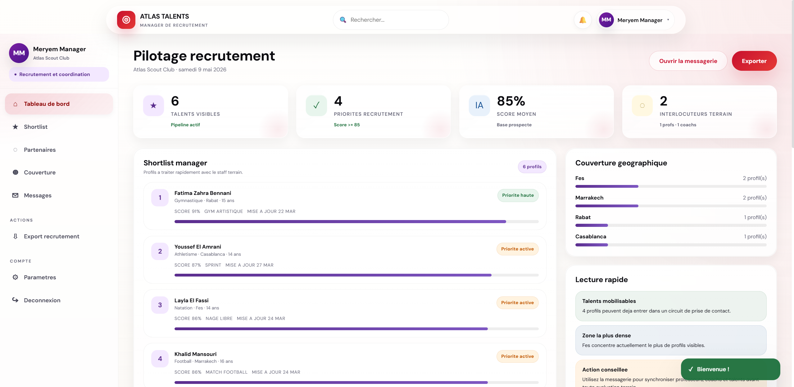
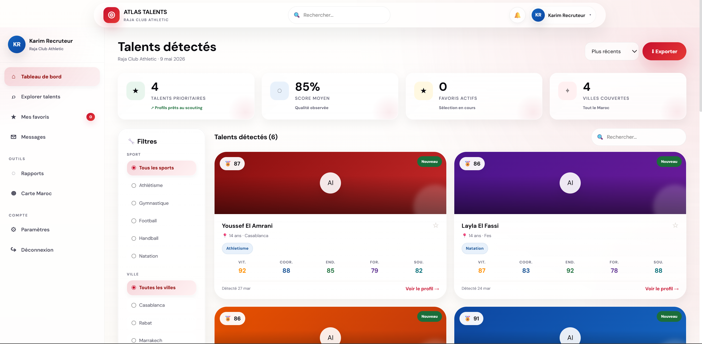
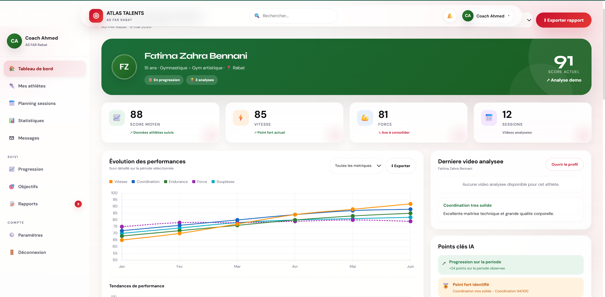
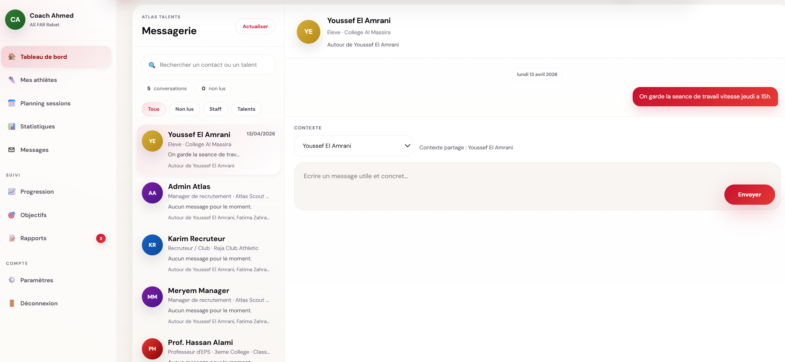

# Atlas Talents 🎯

[](https://php.net)
[](https://mysql.com)
[](https://openai.com)

> **Plateforme SaaS de détection de talents sportifs par intelligence artificielle**  
> *La première plateforme marocaine qui connecte professeurs d'EPS, recruteurs et clubs grâce à l'IA*

---

## 📸 Aperçu de la plateforme

### Page d'accueil


### Fonctionnalités


### Connexion


### Dashboard Professeur


### Upload vidéo


### Dashboard Élève


### Dashboard Manager


### Dashboard Recruteur


### Dashboard Coach


### Messagerie intégrée


---

## 🤖 Agent IA – Analyse vidéo intelligente

| Fonctionnalité | Description |
|----------------|-------------|
| **Extraction automatique** | Keyframes extraites côté navigateur (6 images clés) |
| **Analyse vision** | via OpenAI GPT-4.1-mini |
| **5 critères physiques** | Vitesse, Coordination, Endurance, Force, Souplesse |
| **Scoring global** | 0-100, pondéré selon le sport |
| **Résumé intelligent** | Points forts, axes de progression, recommandations |
| **Mode démo** | Analyse locale cohérente si clé API manquante |

---

## 👥 6 rôles métiers – Dashboards dédiés

| Rôle | Fonctionnalités clés |
|------|----------------------|
| 👨‍🏫 **Professeur** | Upload vidéo, analyse IA, suivi élèves, export PDF |
| 👟 **Élève** | Dashboard personnel, scores, progression |
| 🧭 **Manager** | Pipeline talents, shortlist, messagerie fédérée |
| 🏢 **Recruteur** | Filtres avancés, favoris, messagerie |
| 🏅 **Coach** | Suivi athlètes, graphiques Chart.js, radar IA |
| 🔧 **Admin** | Supervision plateforme, monitoring |

---

## 🛠️ Stack technique

| Catégorie | Technologies |
|-----------|--------------|
| **Backend** | PHP 8, PDO, MySQL, sessions sécurisées |
| **Frontend** | HTML5/CSS3, JavaScript vanilla, Design System custom |
| **IA / Vision** | OpenAI API (GPT-4.1-mini), extraction keyframes navigateur |
| **Graphiques** | Chart.js (line, bar, radar, doughnut) |
| **Sécurité** | CSRF, CSP, en-têtes HTTP, stockage hors webroot |
| **API** | REST endpoints (JSON) |

---

## 🚀 Installation rapide

```bash
# 1. Cloner le projet
git clone https://github.com/Idriss-23/atlas-talents.git
cd atlas-talents

# 2. Copier la configuration
cp .env.example .env

# 3. Configurer la base de données
# Éditez .env avec vos identifiants MySQL

# 4. Importer le schéma
mysql -u root -p < schema.sql

# 5. (Optionnel) Importer les données démo
mysql -u root -p atlas_talents < seed_demo.sql

# 6. Lancer le serveur
php -S localhost:8000
